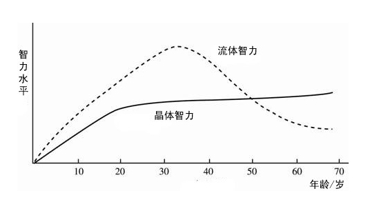

# 35岁的那些事儿

本文的阅读对象，主要是针对程序员群体。但对其他群体，也极具有参考价值。

## 1.生理上，会发生哪些变化？

先认识2种不同类型的智力。

- `流体智力`。是一种以生理为基础的认知能力，指的是个体在新情境中解决问题的能力，通常与逻辑推理、抽象思维和快速学习新知识、创造的能力相关。
- `晶体智力`。是指个体通过经验和学习所获得的知识和技能，通常与语言能力、文化知识和专业技能相关。

总结来说，流体智力更侧重于**解决新问题和适应变化的能力**，而晶体智力则侧重于**应用已有知识和经验的能力**。在工作中，两者都是重要的，流体智力帮助员工应对新挑战，而晶体智力则确保他们能够有效地利用已有的知识和技能。

人到了35岁，**流体智力会减退，晶体智力会平稳上升**。如图所示

所以，有些职业受年龄增长的影响较小，有些职业受到的影响很大。

流体智力为主的职业：如科研人员，软件开发，设计师，数据分析师等。
晶体智力为主的职业：医生，教师，律师，会计师，作家等。

## 2.流体智力的职业，如何应对？

如果到了35岁，我们从事的职业是以流体智力为主，那么我们就需要考虑平滑过渡到晶体智力为主的职业。

我是程序员，该如何应对呢？

- 转向其他岗位。如项目经理、技术经理、产品经理、架构师、售前工程师等以经验应用为主的岗位。
- 编程老师，编程教练。
- 做自己的事业。
- 副业，用输出倒逼输入。

## 3.把被动选择，转为主动选择

假如您是30岁，就看到了这篇文章，那么我恭喜你，你是幸运儿。因为您有足够的时间，把35岁时的被动选择，变为主动选择。

如果您已经35岁了，也不要焦虑。可以从这几方面来入手：
- 积极的心态。许多人在35岁或更晚的时候选择转型，许多成功的职业人士都是在这个年龄段或之后才找到自己的真正热情和方向。
- 终身学习。无论年龄多大，学习都是一个持续的过程。通过参加课程、培训和获取认证，您可以不断提升自己的能力。
- 现在开始行动。设定目标，小步快跑，去行动吧。

## 4.我是程序员，应该如何发展呢？

如果我们只是一名普通的程序员，那么在老板眼里，你就是一个工具人。如果业务没了，产品被砍了，直接把你裁掉，对公司丝毫没有任何影响。

除了技术之外，应该接触一些其他领域的事情，如
- 市场需求的变化。
- 产品商业化。
- 客户沟通，提高沟通能力。
- 懂业务。

## 5.“35岁中年”有哪些危机？

除了上面说的**职业危机**外，还有哪些危机呢？

- **生活危机**。上有老，下有小。我们最亲的人，随时都有可能需要你。如何来平衡生活和工作，就成了一门难题。
- **财务危机**。房贷，车贷，老人生病，子女教育，处处都需要钱。如何来解决经济问题，也是一门难题。假如再有职业危机的话，会导致个人收入来源的不确定性，更是让你雪上加霜。
- **健康危机**。随着年龄的增长，身体的代谢率可能下降，容易出现健康问题，如肥胖、高血压等。另外，还可能会面临焦虑、抑郁等心理健康问题，尤其是在职业和家庭压力较大的情况下。

## 6.普通人如何应对这些危机？

- 身心健康。这是最基础的，也是最重要的。
- 财务规划。1）储备金，准备6个月的家庭开支，对抗风险。2）投资理财。学习基础的投资理财知识，例如基金、保险、股票等工具，合理分配资产，实现财富增值。我更倾向于指数基金定投，长期持有，获取复利。这是普通人最简单，最有效的理财方式。3）保险。建议购买意外险、重疾险、大病医疗。其他的，不建议购买。
- 建立多元化收入。除了主业外，可以发展副业，增加收入来源。
- 建立人脉网络。多参加一些活动，多认识一些朋友，多积累一些人脉资源。但有一点：必须是有效人脉，不要为了人脉而人脉，而是为了解决问题而人脉。
- 保持学习。无论年龄多大，学习都是一个持续的过程。通过参加课程、培训和获取认证等各种方式，您可以不断提升自己的能力。
- `拥抱AI`。AI是未来的趋势，也是普通人逆袭的利器。未来职业的竞争可能更多是人与AI的结合，学习相关知识，将自己从被替代者转变为驾驭者。
